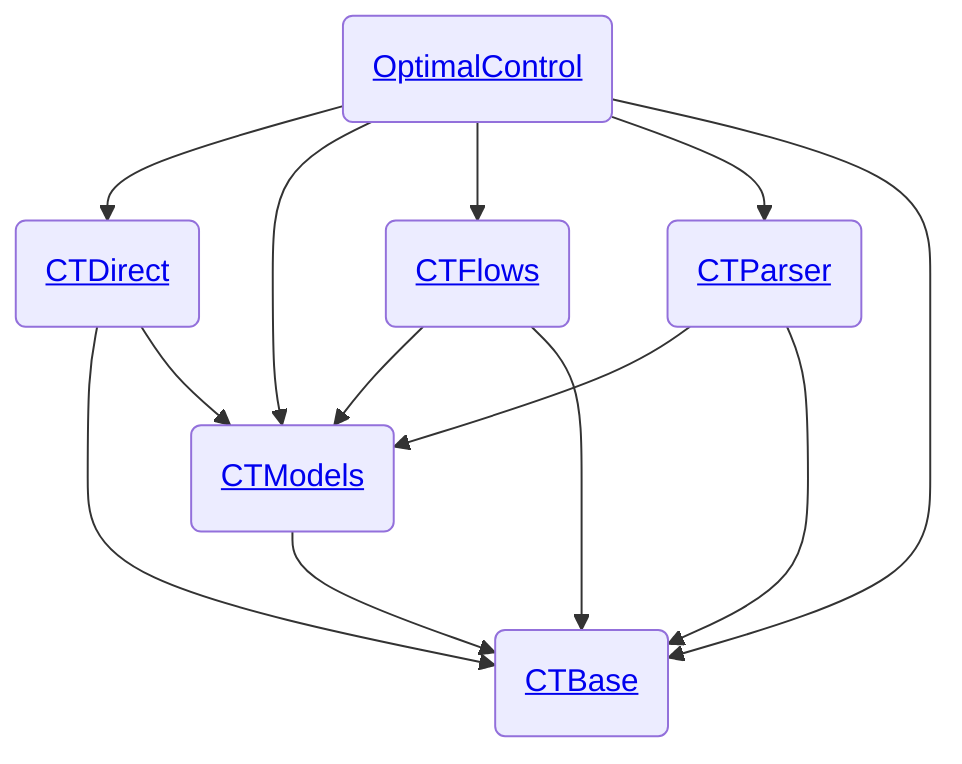

# Development Workflows - control-toolbox Ecosystem

This repository contains **development workflows, guides, and tools** for managing the [control-toolbox](https://github.com/control-toolbox) Julia ecosystem. It serves as a central hub for:

- 📚 **Documentation** on dependency management and breaking changes
- 🤖 **Automated workflows** for migration planning
- 🧪 **CI/CD templates** for integration testing
- 📊 **Migration reports** and case studies

## Getting Started

### For Package Maintainers

1. **Read the guides**:
   - [Local Registry Guide](local-registry-guide.md) - Setup ct-registry for beta versions
   - [Diamond Dependency Problem](diamond-dependency.md) - Understand Julia's resolver mechanics

2. **Use automated workflows**:
   - `/breaking-setup` - Start a new breaking change migration
   - `/breaking-action-plan` - Generate a migration plan

3. **Follow case studies** for your scenario (see [Case Studies](#case-studies))

### For CI/CD Integration

1. **Copy workflow templates** from [`yml/`](yml/) to your package's `.github/workflows/`
2. **Configure secrets** following the [Local Registry Guide](local-registry-guide.md#github-actions-integration)
3. **Enable breakage testing** using [CTActions](https://github.com/control-toolbox/CTActions)

## Ecosystem Architecture



**Core packages:**

- **CTBase**: Foundation types and functions
- **CTModels**: Optimal control problem models
- **CTParser**: Problem definition parser
- **CTDirect**: Direct solution methods
- **CTFlows**: Flow and continuation methods
- **OptimalControl**: Main unifying package

## Dependency Management

Managing dependencies in an ecosystem with diamond dependencies (multiple packages depending on a common base) requires careful coordination during breaking changes.

### Background

- [Local Registry Guide](local-registry-guide.md) — Complete guide to setting up and using ct-registry for beta versions and GitHub Actions integration.
- [Diamond Dependency Problem](diamond-dependency.md) — Understanding Julia's resolver mechanics and the beta version strategy for safe ecosystem migrations.

### Case Studies

Step-by-step tutorials demonstrating breaking change workflows:

| Case Study | Breaking Package | Complexity | Key Learning |
| ---------- | ---------------- | ---------- | ------------ |
| [CTDirect Breaking Change](case-study-ctdirect-breaking.md) | CTDirect | Simple | Single package update with backward-compatible, internal, and public breaking scenarios |
| [CTModels Breaking Change](case-study-ctmodels-breaking.md) | CTModels | Medium | Mid-layer package update affecting multiple dependents (CTDirect, CTParser) |
| [CTBase Cascading Change](case-study-ctbase-cascading.md) | CTBase | Complex | Foundation package update with full cascade through CTModels → CTDirect |

### Automated Workflows

Agent-assisted workflows for managing breaking changes:

| Workflow | Command | Purpose |
| -------- | ------- | ------- |
| [Breaking Setup](.agent/workflows/breaking-setup.md) | `/breaking-setup` | Initial setup and information gathering |
| [Action Plan](.agent/workflows/breaking-action-plan.md) | `/breaking-action-plan` | Generate phase-by-phase migration plan |

**Methodology**: [Breaking Change Rules](breaking-change-rules.md) — Fundamental invariants for migration plans

**Reports**: Setup reports and action plans saved in [`reports-breaking/`](reports-breaking/)

## CI/CD Workflows

### GitHub Actions Templates

Reusable workflow templates are available in the [`yml/`](yml/) directory:

- **[CI.yml](yml/CI.yml)** - Basic continuous integration template
- **[breakage.yml](yml/breakage.yml)** - Breakage testing workflow (local version)

**Production workflows** are centralized in [CTActions](https://github.com/control-toolbox/CTActions):

- [`breakage.yml`](https://github.com/control-toolbox/CTActions/blob/main/.github/workflows/breakage.yml) - Test if changes break dependent packages

### Integration Testing

The breakage testing workflow verifies that changes in base packages don't break dependent packages. It supports:

- ✅ Testing against **latest** or **stable** versions
- ✅ Using **beta versions** from ct-registry
- ✅ Running **tests** or **documentation builds**
- ✅ Automatic **PR comments** with results

**Setup guide**: See [Local Registry Guide - GitHub Actions Integration](local-registry-guide.md#github-actions-integration)

**Example usage**:

```yaml
# In your package's .github/workflows/ci.yml
jobs:
  breakage:
    uses: control-toolbox/CTActions/.github/workflows/breakage.yml@main
    with:
      pkgname: CTDirect
      pkgpath: control-toolbox
      pkgversion: latest
    secrets:
      SSH_KEY: ${{ secrets.SSH_KEY }}
```

## Repository Structure

```
dev-workflows/
├── README.md                          # This file
├── local-registry-guide.md            # ct-registry setup and usage
├── diamond-dependency.md              # Julia resolver mechanics
├── breaking-change-rules.md           # Migration methodology
├── case-study-*.md                    # Breaking change tutorials
├── .agent/workflows/                  # Automated workflows
│   ├── breaking-setup.md
│   └── breaking-action-plan.md
├── yml/                               # CI/CD templates
│   ├── CI.yml
│   └── breakage.yml
└── reports-breaking/                  # Migration reports
    └── YYYY-MM-DD-package-version/
```

## Resources

- [control-toolbox GitHub Organization](https://github.com/control-toolbox)
- [OptimalControl.jl Documentation](https://control-toolbox.org/OptimalControl.jl/stable/)
- [CTActions - Reusable GitHub Actions](https://github.com/control-toolbox/CTActions)
- [ct-registry - Local Julia Registry](https://github.com/control-toolbox/ct-registry)
