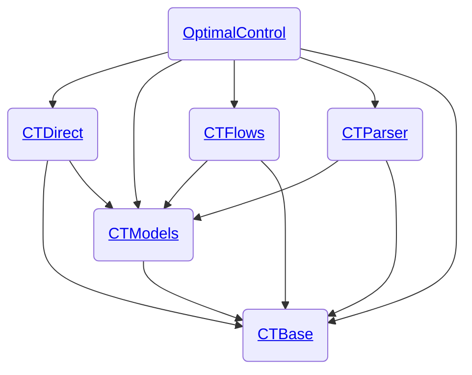

# Development Workflows - control-toolbox Ecosystem

This repository contains development workflows and guides for the [control-toolbox](https://github.com/control-toolbox) ecosystem.

## Ecosystem Architecture

**Core packages:**

- **CTBase**: Foundation types and functions
- **CTModels**: Optimal control problem models  
- **CTParser**: Problem definition parser
- **CTDirect**: Direct solution methods
- **CTFlows**: Flow and continuation methods
- **OptimalControl**: Main unifying package

## Dependency Management

Managing dependencies in an ecosystem with diamond dependencies (multiple packages depending on a common base) requires careful coordination during breaking changes.

### Background

- [Diamond Dependency Problem](diamond-dependency.md) — Understanding Julia's resolver mechanics and the beta version strategy for safe ecosystem migrations.

### Case Studies

Step-by-step tutorials demonstrating breaking change workflows:

| Case Study | Breaking Package | Complexity | Key Learning |
|------------|------------------|------------|--------------|
| [CTDirect Breaking Change](case-study-ctdirect-breaking.md) | CTDirect | Simple | Single package update with backward-compatible, internal, and public breaking scenarios |
| [CTModels Breaking Change](case-study-ctmodels-breaking.md) | CTModels | Medium | Mid-layer package update affecting multiple dependents (CTDirect, CTParser) |
| [CTBase Cascading Change](case-study-ctbase-cascading.md) | CTBase | Complex | Foundation package update with full cascade through CTModels → CTDirect |

## Integration Testing

Verify that changes in base packages don't break dependent packages using the [breakage.yml](https://github.com/control-toolbox/CTActions/blob/main/.github/workflows/breakage.yml) GitHub Actions workflow.

## Resources

- [control-toolbox GitHub Organization](https://github.com/control-toolbox)
- [OptimalControl.jl Documentation](https://control-toolbox.org/OptimalControl.jl/stable/)
- [CTActions - Reusable GitHub Actions](https://github.com/control-toolbox/CTActions)
